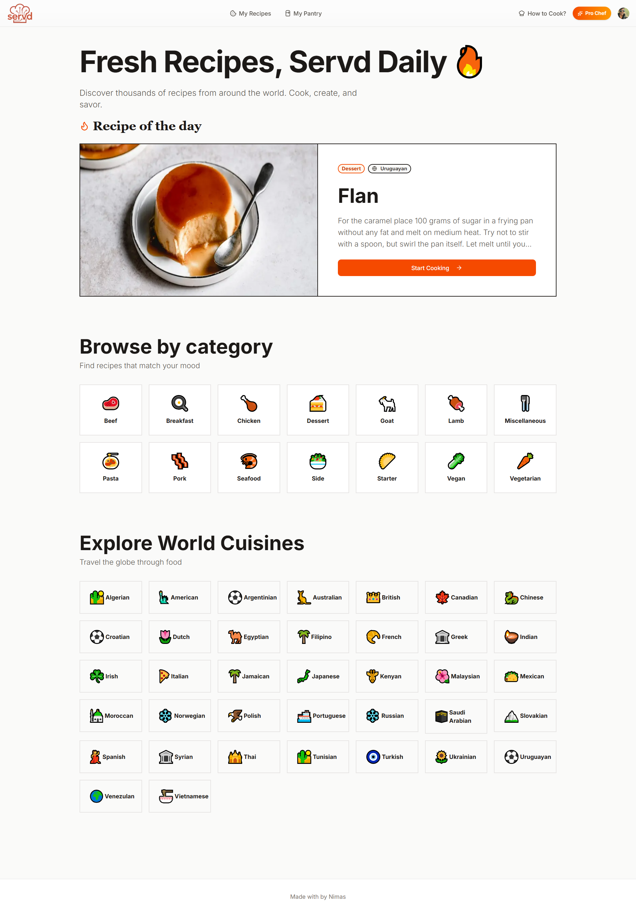
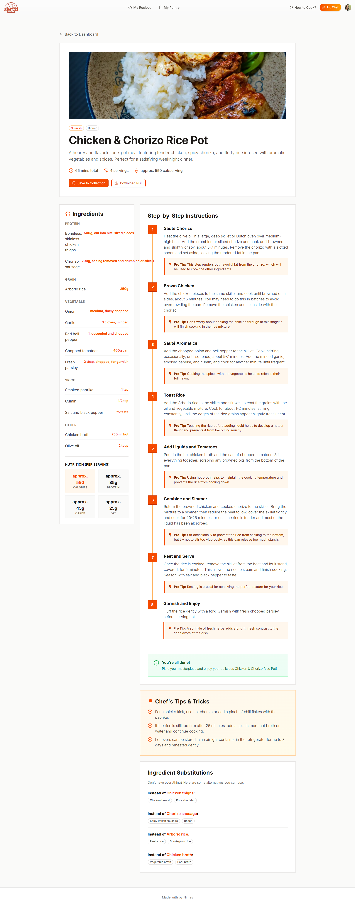
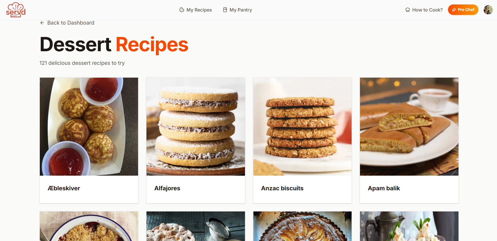
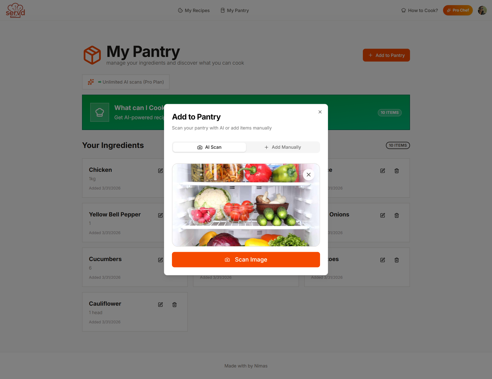
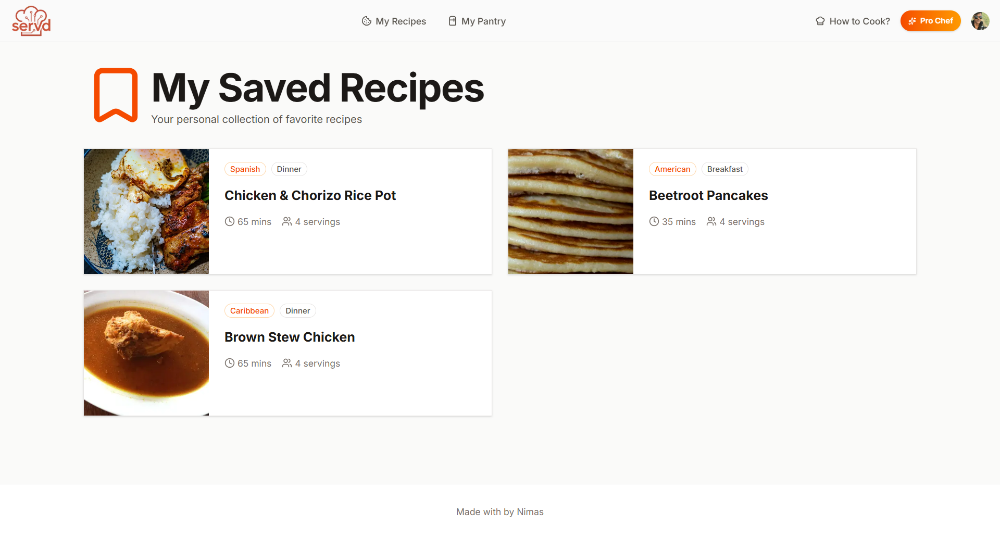

# 🍽️ Servd — Full Stack AI Recipe Platform

An AI-powered recipe platform that scans your pantry, suggests recipes based on available ingredients, and generates detailed cooking instructions — all with a beautiful, responsive UI.

---

## 📸 Screenshots

### Home Page



### Recipe Page



### Recipe-Category Page



### AddToPantry Page



### Recipes Page



## 🚀 Tech Stack

| Technology           | Purpose                                 |
| -------------------- | --------------------------------------- |
| **Next.js 15**       | Full-stack React framework (App Router) |
| **Tailwind CSS**     | Utility-first styling                   |
| **Shadcn UI**        | Accessible component library            |
| **Strapi**           | Headless CMS & REST API backend         |
| **Neon DB**          | Serverless PostgreSQL database          |
| **Clerk**            | Authentication & user management        |
| **Google Gemini AI** | Recipe generation & pantry scanning     |
| **Unsplash API**     | Recipe photography                      |
| **Arcjet**           | Rate limiting & security                |
| **React PDF**        | PDF recipe export                       |

---

## ✨ Features

- 📸 **AI Pantry Scanner** — Upload a photo of your fridge/pantry and Gemini AI identifies all ingredients automatically
- 🍳 **Recipe Generation** — Generate detailed, step-by-step recipes based on your pantry ingredients
- 🔖 **Recipe Collection** — Save your favourite recipes to your personal cookbook
- 📄 **PDF Export** — Download any recipe as a beautifully formatted PDF
- 🔐 **Authentication** — Secure sign-in/sign-up with Clerk
- 💎 **Pro Tier** — Unlock nutrition info, chef tips, ingredient substitutions, and unlimited scans
- 🛡️ **Rate Limiting** — Arcjet-powered protection with tier-based request limits
- 📱 **Fully Responsive** — Works seamlessly on mobile, tablet, and desktop

---

## 📁 Project Structure

```
├── app/
│   ├── (main)/
│   │   ├── dashboard/        # Main dashboard
│   │   ├── pantry/           # Pantry management
│   │   │   └── recipes/      # AI recipe suggestions
│   │   └── recipe/           # Individual recipe view
│   ├── recipes/              # Saved recipes collection
│   └── layout.js             # Root layout with Clerk & Header
├── actions/
│   ├── pantry.actions.js     # Pantry CRUD & AI scanning
│   └── recipe.actions.js     # Recipe generation & collection
├── components/
│   ├── ui/                   # Shadcn UI components
│   ├── Header.jsx
│   ├── RecipeCard.jsx
│   ├── RecipePDF.jsx
│   ├── PricingModal.jsx
│   └── ProLockedSection.jsx
├── hooks/
│   └── use-fetch.js          # Custom fetch hook with loading/error state
├── lib/
│   ├── arcjet.js             # Rate limit configurations
│   ├── checkUser.js          # User sync between Clerk & Strapi
│   └── data.js               # Static data & helper functions
└── backend/                 # Strapi backend
```

---

## ⚙️ Getting Started

### Prerequisites

- Node.js 18+
- npm or yarn
- A [Neon](https://neon.tech) PostgreSQL database
- A [Clerk](https://clerk.com) account
- A [Google AI Studio](https://aistudio.google.com) API key
- An [Unsplash](https://unsplash.com/developers) developer account
- An [Arcjet](https://arcjet.com) account

### 1. Clone the Repository

```bash
git clone https://github.com/Kafoor-Nimas/AI-Recipe.git
cd servd
```

### 2. Install Frontend Dependencies

```bash
cd frontend
npm install
```

### 3. Install Strapi Dependencies

```bash
cd backend
npm install
```

### 4. Configure Environment Variables

Create a `.env` file in the frontend of your Next.js project:

```env
# Strapi
NEXT_PUBLIC_STRAPI_URL=http://localhost:1337
STRAPI_API_TOKEN=your_strapi_api_token

NEXT_PUBLIC_CLERK_SIGN_IN_URL=/sign-in
NEXT_PUBLIC_CLERK_SIGN_UP_URL=/sign-up

# Clerk
NEXT_PUBLIC_CLERK_PUBLISHABLE_KEY=your_clerk_publishable_key
CLERK_SECRET_KEY=your_clerk_secret_key

# Google Gemini
GEMINI_API_KEY=your_gemini_api_key

# Unsplash
UNSPLASH_ACCESS_KEY=your_unsplash_access_key

# Arcjet
ARCJET_KEY=your_arcjet_key
```

Configure Strapi's `.env` file in the backend of your Next.js project:

```env

# Server
HOST=0.0.0.0
PORT=1337

DATABASE_CLIENT=postgres
DATABASE_HOST=your_neon_host
DATABASE_PORT=5432
DATABASE_NAME=neondb
DATABASE_USERNAME=your_username
DATABASE_PASSWORD=your_password
DATABASE_SSL=true
```

### 5. Start Strapi Backend

```bash
cd backend
npm run develop
```

Strapi will be available at `http://localhost:1337/admin`

### 6. Start Next.js Frontend

```bash
cd frontend
npm run dev
```

The app will be available at `http://localhost:3000`

---

## 🗄️ Strapi Content Types

| Collection      | Description                                                 |
| --------------- | ----------------------------------------------------------- |
| `recipes`       | Generated recipes with ingredients, instructions, nutrition |
| `pantry-items`  | User's pantry ingredients                                   |
| `saved-recipes` | Junction table for user recipe bookmarks                    |
| `users`         | Extended user profiles synced from Clerk                    |

---

## 🔑 API Rate Limits (Arcjet)

| Feature                | Free Tier | Pro Tier  |
| ---------------------- | --------- | --------- |
| Pantry Scans           | 10/month  | Unlimited |
| Recipe Recommendations | 5/month   | Unlimited |

---

## 🚢 Deployment

### Deploy Next.js (Vercel)

1. Push your project to GitHub
2. Import to [Vercel](https://vercel.com)
3. Add all environment variables in the Vercel dashboard
4. Update `NEXT_PUBLIC_STRAPI_URL` to your deployed Strapi URL
5. Switch Clerk to production keys
6. Deploy

### Next.js Image Domains

Make sure your `next.config.js` includes:

```js
images: {
    remotePatterns: [
      {
        protocol: "https",
        hostname: "www.themealdb.com",
      },
      {
        protocol: "https",
        hostname: "images.unsplash.com",
      },
      {
        protocol: "http",
        hostname: "localhost",
      },
    ],
  },
```

---

## 🤝 Contributing

1. Fork the repository
2. Create a feature branch (`git checkout -b feature/amazing-feature`)
3. Commit your changes (`git commit -m 'Add amazing feature'`)
4. Push to the branch (`git push origin feature/amazing-feature`)
5. Open a Pull Request

---

## 🌐 Live Demo

[View Live Demo](https://ai-recipe-servd.vercel.app)

---

## 👨‍💻 Author

**Nimas Kafoor**

- 🌐 Portfolio: [nimas-portfolio.vercel.app](https://nimas-portfolio.vercel.app/)
- 💼 LinkedIn: [linkedin.com/in/nimas-kafoor](https://www.linkedin.com/in/nimas-kafoor)
- 🐙 GitHub: [github.com/Kafoor-Nimas](https://github.com/Kafoor-Nimas)
- 📧 Email: [nimaskafoor@gmail.com](mailto:nimaskafoor@gmail.com)

## 🙏 Acknowledgements

- [Google Gemini](https://ai.google.dev) for AI-powered recipe generation
- [Unsplash](https://unsplash.com) for beautiful food photography
- [Shadcn UI](https://ui.shadcn.com) for the component library
- [Clerk](https://clerk.com) for seamless authentication
- [Arcjet](https://arcjet.com) for security and rate limiting
